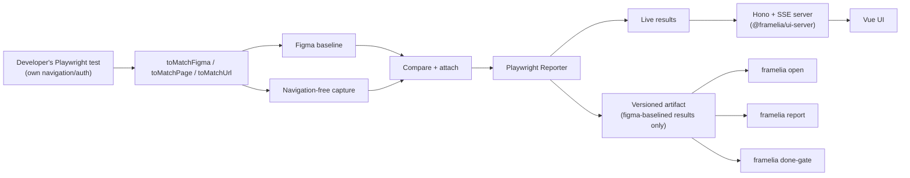
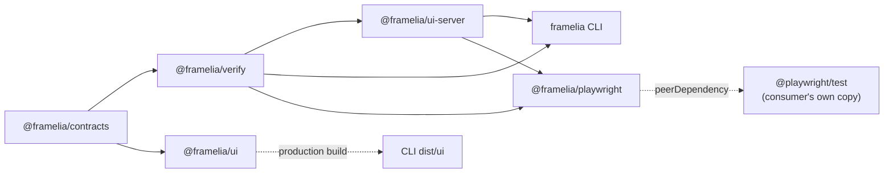

# Framelia

Playwright custom matchers (`toMatchFigma`, `toMatchPage`, `toMatchUrl`) for Figma-to-web and
web-to-web visual verification, plus a CLI for browsing and gating the evidence they produce.

## Architecture

Framelia does not own navigation, authentication, or browser-context creation — a developer's own
`@playwright/test` suite does, and calls a framelia matcher at the point it wants to capture and
diff. `@framelia/playwright`'s Reporter drives a live UI during that run and persists a
portable artifact afterward; the CLI never coordinates capture itself.



Artifact remains source of truth. Live events only update progress before final artifact lands. No database, hosted service, account, or cloud state.

### Runtime modes

| Command                                        | Engine run                    | Server | Browser UI         | Output                                       |
| ---------------------------------------------- | ----------------------------- | ------ | ------------------ | -------------------------------------------- |
| `npx playwright test` (matchers, no reporter)  | Yes (your Playwright process) | No     | No                 | Test pass/fail + attachments                 |
| `npx playwright test` (with framelia Reporter) | Yes (your Playwright process) | Yes    | Live UI            | Test pass/fail + JSON artifact + live events |
| `framelia open`                                | No                            | Yes    | Archived UI        | Existing artifact                            |
| `framelia report`                              | No                            | No     | Portable static UI | Static report directory                      |
| `framelia done-gate`                           | No                            | No     | No                 | Independent persisted-evidence verdict       |

## Workspace

```text
apps/
└── ui/                      # Vue/Vite + Nuxt UI; depends only on contracts
packages/
├── contracts/               # versioned request, artifact, UI, event contracts
├── verify/                  # baseline resolution, capture primitive, compare, done-gate
├── ui-server/               # Hono/SSE server + result-projection, shared by cli and playwright
├── playwright/              # toMatchFigma / toMatchPage / toMatchUrl matchers + Reporter
└── cli/                     # framelia binary: init, contract create, status, schema,
    │                        # open, report, ui, fetch-gold, compare, done-gate
    └── dist/ui/             # generated UI bundled in npm package
```

Package dependency and build direction:



`framelia` remains public compatibility package and CLI distribution. It re-exports
`@framelia/contracts` and `@framelia/verify`; UI source never imports CLI or engine
internals. `@framelia/verify` never depends on `hono`/`@hono/node-server` — that HTTP dependency
lives only in `@framelia/ui-server`, so neither `@framelia/verify` nor a matcher-only
`@framelia/playwright` consumer's core capture/compare path pulls it in for that reason alone.

## Development

Requirements: Node.js 22.13+, pnpm 11.18+, Chromium for Playwright.

```bash
pnpm install
pnpm exec playwright install chromium
pnpm validate
```

### Preview UI

Run UI with mock evidence and HMR; no contract or backend required:

```bash
pnpm dev:ui
```

Open URL printed by Vite. Mock covers passed, failed, blocked, Figma baseline, viewport capture, and element capture.

### Run full product

Build UI bundled into CLI:

```bash
pnpm build
```

Exercise a real matcher run with the live UI, from any project that has
`@framelia/playwright` registered (see [`packages/playwright/README.md`](packages/playwright/README.md)
for a full quickstart):

```ts
// playwright.config.ts
export default defineConfig({
  reporter: [["@framelia/playwright/reporter"], ["html"]],
});
```

```bash
npx playwright test
```

The Reporter prints the UI URL and keeps the server up until the Playwright process exits.

Open an existing artifact without rerunning:

```bash
pnpm framelia open \
  --artifact /absolute/path/to/visual-verification.json
```

### Run UI with HMR

Use mock mode above for normal UI work. To debug real artifact/API integration, start archived UI backend first:

```bash
pnpm build
pnpm framelia open \
  --artifact /absolute/path/to/visual-verification.json \
  --no-open
```

Command prints backend URL such as `http://127.0.0.1:43127`. Keep process running. In second terminal, pass URL to Vite proxy:

```bash
FRAMELIA_API_ORIGIN=http://127.0.0.1:43127 pnpm dev:ui
```

Open Vite URL, normally `http://localhost:5173`. Vite proxies `/api`, `/artifacts`, and `/events` to CLI backend; Vue changes update through HMR.

### Common checks

```bash
pnpm typecheck
pnpm test
pnpm build
pnpm validate
```

Inspect CLI commands:

```bash
pnpm framelia --help
```

Detailed contract, command, artifact, and UI documentation lives in [`packages/cli/README.md`](packages/cli/README.md).

Playwright matcher, Reporter, and getting-started quickstart documentation lives in
[`packages/playwright/README.md`](packages/playwright/README.md).

UI-specific development and HMR instructions live in [`apps/ui/README.md`](apps/ui/README.md).

## Repository boundary

This repository owns verification engine, CLI, UI, artifacts, tests, and npm releases. Agent skills and plugin adapters remain in [`hungify/skills`](https://github.com/hungify/skills) and consume released `framelia` commands.
