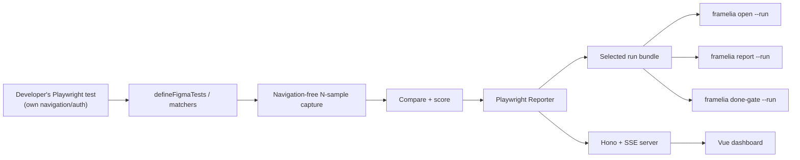
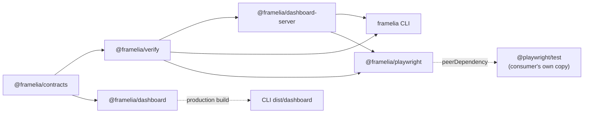

# Framelia

Playwright custom matchers (`toMatchFigma`, `toMatchPage`, `toMatchUrl`) for Figma-to-web and
web-to-web visual verification, plus a CLI for browsing and gating the evidence they produce.

## Architecture

Framelia does not own navigation, authentication, or browser-context creation — a developer's own
`@playwright/test` suite does, and calls a Framelia matcher at the point it wants to capture and
diff. `@framelia/playwright`'s Reporter drives a live dashboard and publishes immutable
run/case/attempt records plus digest-addressed evidence under `.framelia/runs/<run-id>/`.



The selected run bundle is the durable source of truth. Live events only report progress before
attempt publication/finalization. No database, hosted service, account, or cloud state is involved.

### Runtime modes

| Command                                        | Engine run                    | Server | Browser UI                | Output                             |
| ---------------------------------------------- | ----------------------------- | ------ | ------------------------- | ---------------------------------- |
| `npx playwright test` (matchers, no reporter)  | Yes (your Playwright process) | No     | No                        | Test pass/fail + attachments       |
| `npx playwright test` (with Framelia Reporter) | Yes (your Playwright process) | Yes    | Live selected-run view    | Immutable run bundle + live events |
| `framelia check --all` / `--contract <id>`     | Yes (local Playwright)        | No     | No                        | Exact JSON outcome + run bundle    |
| `framelia open --run <id>`                     | No                            | Yes    | Selected-run dashboard    | Existing run bundle                |
| `framelia report --run <id>`                   | No                            | No     | Portable static dashboard | Relocatable selected-run report    |
| `framelia done-gate --run <id>`                | No                            | No     | No                        | Trusted authoritative run verdict  |

## Workspace

```text
apps/
└── dashboard/               # Vue/Vite + Nuxt UI; depends only on contracts
packages/
├── contracts/               # versioned authored, workflow, dashboard, and event contracts
├── verify/                  # baseline resolution, capture, comparison, and run-bundle readers
├── dashboard-server/        # Hono/SSE server + result-projection, shared by cli and playwright
├── playwright/              # toMatchFigma / toMatchPage / toMatchUrl matchers + Reporter
├── cli/                     # framelia binary: init, check, contract create/list/refresh,
    │                        # status, schema, open, report, dashboard, compare, done-gate
    └── dist/dashboard/      # generated dashboard bundled in npm package
```

Package dependency and build direction:



`framelia` remains public compatibility package and CLI distribution. It re-exports
`@framelia/contracts` and `@framelia/verify`; dashboard source never imports CLI or engine
internals. `@framelia/verify` never depends on `hono`/`@hono/node-server` — that HTTP dependency
lives only in `@framelia/dashboard-server`, so neither `@framelia/verify` nor a matcher-only
`@framelia/playwright` consumer's core capture/compare path pulls it in for that reason alone.

## Development

Requirements: Node.js 22.13+, pnpm 11.18+, Chromium for Playwright.

```bash
pnpm install
pnpm exec playwright install chromium
pnpm validate
```

### Preview dashboard

Run dashboard with mock evidence and HMR; no contract or backend required:

```bash
pnpm dev:dashboard
```

Open URL printed by Vite. Mock covers passed, failed, blocked, Figma baseline, viewport capture, and element capture.

### Run full product

Build dashboard bundled into CLI:

```bash
pnpm build
```

Exercise a real matcher run with the live dashboard, from any project that has
`@framelia/playwright` registered (see [`packages/playwright/README.md`](packages/playwright/README.md)
for a full quickstart):

```ts
// playwright.config.ts
export default defineConfig({
  reporter: [["@framelia/playwright/reporter"], ["html"]],
});
```

```bash
npx playwright test
```

The Reporter prints the dashboard URL and keeps the server up until the Playwright process exits.

Open one durable run without rerunning:

```bash
pnpm framelia open --project-root "$PWD" --run <run-id>
```

### Run dashboard with HMR

Use mock mode above for normal UI work. To debug a real selected-run/API integration, start its
dashboard backend first:

```bash
pnpm build
pnpm framelia open --project-root "$PWD" --run <run-id> --no-open
```

Command prints backend URL such as `http://127.0.0.1:43127`. Keep process running. In second terminal, pass URL to Vite proxy:

```bash
FRAMELIA_API_ORIGIN=http://127.0.0.1:43127 pnpm dev:dashboard
```

Open Vite URL, normally `http://localhost:5173`. Vite proxies `/api`, `/artifacts`, and `/events` to CLI backend; Vue changes update through HMR.

### Common checks

```bash
pnpm typecheck
pnpm test
pnpm build
pnpm validate
```

Inspect CLI commands:

```bash
pnpm framelia --help
```

Detailed contract, command, artifact, and dashboard documentation lives in [`packages/cli/README.md`](packages/cli/README.md).

Playwright matcher, Reporter, and getting-started quickstart documentation lives in
[`packages/playwright/README.md`](packages/playwright/README.md).

Dashboard-specific development and HMR instructions live in [`apps/dashboard/README.md`](apps/dashboard/README.md).

### Packed-consumer release verification

CI builds and packs all five release packages from a clean checkout, then installs
the tarballs outside the workspace. The release gate covers npm/pnpm, Node 22.13,
24 and 26, and Playwright 1.61.1 and 1.63.0 in consumer ESM/CommonJS configurations.
It checks native public imports, declarations, dry-run/idempotent CLI initialization without
rewriting existing reporter lists, structured non-TTY authoring failures, schema-compatible
contract fixtures, authored/binding reconciliation, explicit refresh failure without pointer
loss, ordinary collection, reporter dashboard startup, real matcher comparisons, and exact
`framelia check` pass/mismatch runs from a nested directory. The selected mismatch is then read
through explicit `open`, portable `report`, and protected-gate failure paths. The coordinated
fixture also exercises duplicate human names with exact ID selection, unnamed and named visual
projects, project narrowing, repeat slots (including repeated setup and teardown), a
fail-then-pass retry whose first mismatch remains authoritative, deep selected-run JSON, and noisy
user-reporter output. A separate matcher-only install checks that the optional dashboard peer is
not required.

The fixtures use `scale: 1`, supported by the current `main` schema. Higher-DPR
contract/capture support is separate work, not part of this distribution fix.

To exercise an already-built release set locally:

```bash
pnpm build
for package in contracts verify dashboard-server playwright cli; do
  pnpm --dir "packages/$package" pack --pack-destination "$PWD/.release/$package"
done
pnpm test:consumer --pack-dir .release --package-manager npm --install-browser
pnpm test:consumer --pack-dir .release --package-manager pnpm --install-browser
```

`--install-browser` explicitly installs the selected consumer runner's Chromium
(and Linux system dependencies). Omit it when that browser is already available.
Temporary consumers are removed after each scenario. The harness never contacts Figma: authoring
acquisition is faked in unit tests, while packed consumers use reviewed schema-compatible pinned
fixtures and verify explicit refresh failure with no credential or pointer mutation.

Publishing consumes the same verified tarballs, not a second build. A smaller
registry smoke checks public entry points and collection after publication.

Distribution changes in this checkout are unreleased until package versions are
advanced and published; the existing `0.0.5` registry artifacts are not replaced.

## Repository boundary

This repository owns verification engine, CLI, dashboard, artifacts, tests, and npm releases. Agent skills and plugin adapters remain in [`hungify/skills`](https://github.com/hungify/skills) and consume released `framelia` commands.
